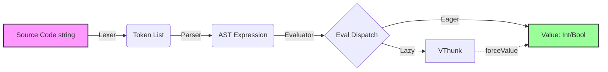
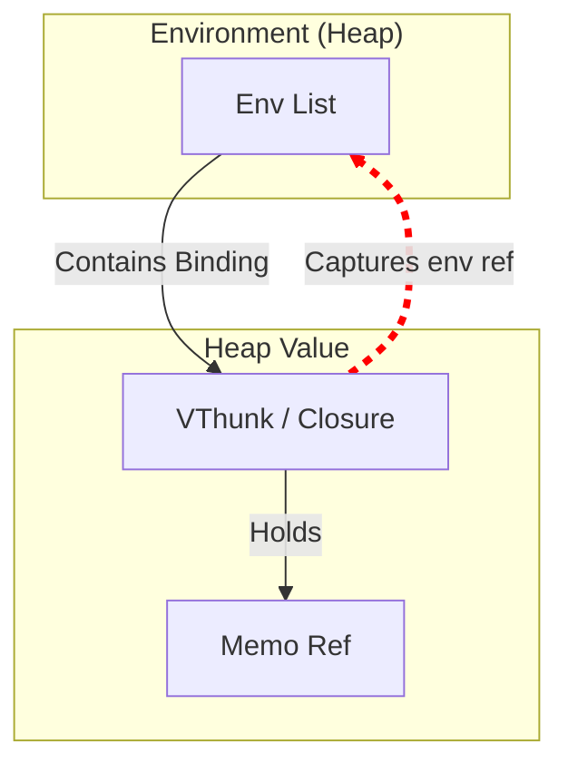

**Description:**
This project implements an interpreter for a Haskell-like language written in Standard ML. The core of the interpreter supports essential functional paradigms including function abstraction, arithmetic, boolean logic, and, crucially, **lazy evaluation** with memoization. It includes a robust handler for mutual recursion within `let` expressions and top-level declarations.

## 2. Key Features

* **Lazy Evaluation & Memoization:** Expressions are not evaluated until needed. Results are cached (memoized) to avoid future re-computations, utilizing `VThunk` data structures.
* **Advanced Environment Management:** Utilization of SML `ref` to handle mutable state required for memoization and for closing recursive environments.
* **Mutual Recursion (Tying the Knot):** Implementation of the "tying the knot" technique to allow functions and `let` expressions to refer to themselves or each other during definition, manipulating environment references (`env ref`).
* **Modular Architecture:** Clean separation between Lexer, Core Interpreter (AST, Parser, Evaluator), and Main Driver (REPL).

## 3. Project Architecture

* **`lexer.sml`**: Handles lexical analysis by converting raw text into a token stream. Supports integers, identifiers, keywords, and string/char literals.
* **`interpreter.sml`**: The core of the system. Defines the Abstract Syntax Tree (AST), recursive parser, and evaluator. This houses the logic for value types like `VClosure` and `VThunk`.
* **`main.sml`**: Manages the interactive session, user input, and execution pipeline (Lexing -> Parsing -> Evaluation) maintaining global state.



## 4. Example 

```haskell
// Example of lazy evaluation and recursion
let 
  isEven = \n -> if n == 0 then true else isOdd (n - 1);
  isOdd  = \n -> if n == 0 then false else isEven (n - 1);
in
  isEven 4
// Output: true (evaluated only when requested)
```

## 5. Technical Details

The system uses a custom value type that includes VThunk. A thunk contains the expression to be evaluated and a reference to the definition environment. When forced (forceValue), the result is calculated and stored in a mutable memo ref.



## 6. Limitations & Roadmap
- Type System: Currently, the type-checker is rudimentary and checks only obvious discrepancies; it lacks full Hindley-Milner style inference.
- Language Subset: Pattern matching, algebraic data types, and list comprehensions are missing.
- Error Reporting: Error messages could be more precise regarding source code position.
